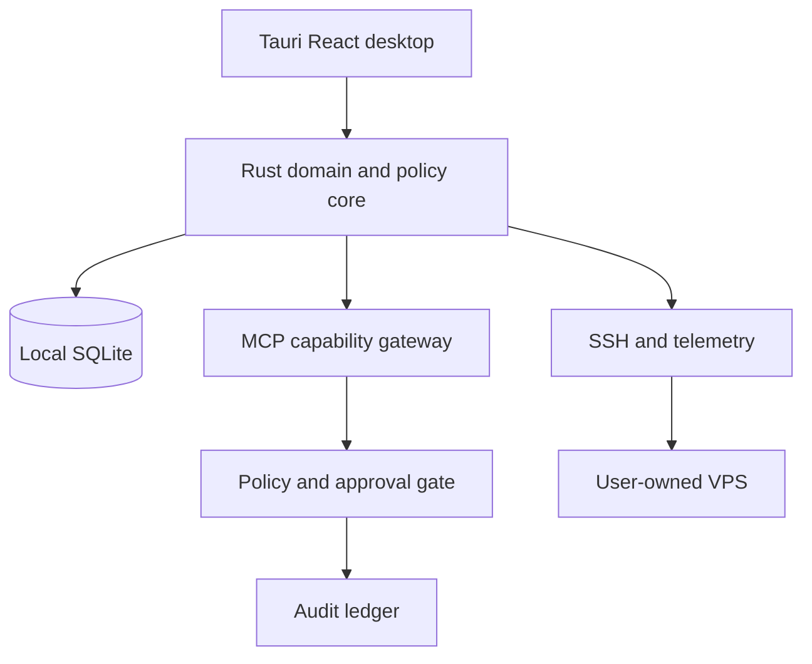

# KyvonOPS

Local-first DevOps control plane for SSH, AI agents, and infrastructure operations.

[Demo / website](https://kyvonops.sys.thuyakyaw.com/) · [Releases](https://github.com/Filip2k03/kyvon_ops/releases) · [Documentation](docs/) · [Report an issue](https://github.com/Filip2k03/kyvon_ops/issues/new/choose)

> **V4.1 status: development preview.** RC7 has CI-built Windows, universal macOS, and Linux installers with a verified SHA256 manifest, but it is an unsigned draft prerelease. A stable download is not advertised until clean installation, signing, packaged SSH, and rollback evidence are complete.

## What is KyvonOPS?

KyvonOPS is a Rust and Tauri desktop workspace for developers, SREs, and
infrastructure operators who manage VPS and remote Linux systems through SSH.
The workspace keeps server configuration and operational state local, uses the
operating system credential store for secrets, and shows measured host data only
after an SSH connection is established.

The control plane connects infrastructure telemetry, diagnostics, logs, and
typed operations in one place. AI clients use MCP capabilities and policy gates;
they do not receive raw SSH credentials or unrestricted shell access.

## Why KyvonOPS?

Traditional workflow:

```text
terminal → SSH → commands → scripts → logs → another terminal
```

KyvonOPS workflow:

```text
desktop workspace → SSH identity check → measured telemetry
                 → MCP capability → policy/approval → operation → audit
```

The desktop remains useful as a local control point when hosted services are
unavailable. The public website never asks for SSH credentials and is not a
hosted control plane.

The desktop client starts with an empty **My VPS** inventory. Nothing is seeded:
connect a VPS, verify its host fingerprint, and run discovery before any host
facts or topology appear. See [`docs/V4.1_CLIENT_ONLY.md`](docs/V4.1_CLIENT_ONLY.md)
for the client-only behavior contract.

## Features

- SSH server management with host-key verification.
- Local SQLite workspace and OS credential/keychain custody.
- Measured CPU, memory, disk, process, service, network, and port telemetry.
- Diagnostics and topology boundaries that show unavailable data honestly.
- MCP tools with typed capabilities, target scoping, policy checks, approval, and audit.
- Rust domain crates, Tauri 2 desktop shell, and a Rust CLI.
- macOS, Windows, and Linux release targets through GitHub Actions.

## 60-second demo

A verified demo should show launch → connect an owned VPS → host identity
confirmation → measured health → a proposed operation → approval gate → audit.
No production credentials or fake metrics belong in a demo. The capture plan is
in [`docs/SCREENSHOT_CAPTURE_PLAN.md`](docs/SCREENSHOT_CAPTURE_PLAN.md).

## Architecture



See [`docs/V4.1_ARCHITECTURE.md`](docs/V4.1_ARCHITECTURE.md) for verified
boundaries and limitations.

## Security model

```text
credentials → OS credential store
AI          → typed capability
operation   → target and policy check
write       → explicit approval
result      → verification and audit
```

Passwords, private keys, tokens, and passphrases are never rendered or sent to
an AI model. Changed SSH host keys stop the connection and require explicit
review. Read [`docs/V4.1_SECURITY.md`](docs/V4.1_SECURITY.md) before operating
on a real host.

## Install

Only install artifacts from a published release after checking its platform,
architecture, signing status, release notes, and SHA256 manifest. RC7 is a
draft validation release, not the stable channel.

### Linux source helper

```sh
git clone https://github.com/Filip2k03/kyvon_ops.git
cd kyvon_ops
./scripts/install.sh --check
./scripts/install.sh --frontend
./scripts/build-desktop.sh
```

The Linux `--desktop` helper downloads only a published AppImage whose checksum
is present in `SHA256SUMS`; it fails closed otherwise. See
[`docs/V4.1_DESKTOP_INSTALLATION.md`](docs/V4.1_DESKTOP_INSTALLATION.md) for
Windows and macOS guidance.

## Quick start

1. Launch the desktop app and open **Servers**.
2. Add a VPS you own: host, port, username, and a supported SSH identity.
3. Review the presented host fingerprint and trust it only after verification.
4. Connect and wait for discovery and telemetry to produce measured values.
5. Use diagnostics and read-only tools before requesting a controlled action.

## CLI

The CLI is in `apps/cli`. Build and inspect its actual commands before use:

```sh
cargo build -p kyvon-cli
cargo run -p kyvon-cli -- --help
```

## MCP and AI agents

KyvonOPS is designed for Codex Astra, Claude Opus, and Agy Gemini 3.8 through
the same capability boundary. An agent may request a typed operation, but the
policy engine decides whether it is allowed and whether human approval is
required. The MCP server is in `apps/mcp`; see [`docs/AGENT_PROFILES.md`](docs/AGENT_PROFILES.md).

## Development

```sh
./scripts/install.sh --check
./scripts/install.sh --frontend
cargo fmt --all -- --check
cargo clippy --workspace --all-targets --all-features -- -D warnings
cargo test --workspace --all-features
cargo build -p kyvon-mcp
cd apps/desktop
bun run build
bun test tests/
```

`bun run lint` remains a separate repository task while its ESLint dependency and
configuration are completed. Native installer claims require the release gate;
frontend and Rust checks alone are not native install proof.

## Roadmap and release truth

The current V4.1 gate is maintained in
[`docs/V4.1_RELEASE_GATE.md`](docs/V4.1_RELEASE_GATE.md) and
[`docs/V4.1_DESKTOP_RELEASE_GATE.md`](docs/V4.1_DESKTOP_RELEASE_GATE.md).
Unsigned RC artifacts, hosted authentication, mobile, voice/video, signed
updates, and rollback evidence remain explicitly classified rather than implied.

## Contributing

Read [`AGENTS.md`](AGENTS.md), [`CLAUDE.md`](CLAUDE.md), and [`PROMPTS.md`](PROMPTS.md)
before editing. Use Conventional Commits, preserve unrelated worktree changes,
keep credentials out of issues and pull requests, and include exact validation
commands. See [`CONTRIBUTING.md`](CONTRIBUTING.md) and the prepared
[`docs/ISSUE_BACKLOG.md`](docs/ISSUE_BACKLOG.md).

## Community

The repository currently has no automated Discussions or social publishing.
The evidence-first plan is in [`docs/DISCUSSION_PLAN.md`](docs/DISCUSSION_PLAN.md)
and [`docs/MARKETING_PLAYBOOK.md`](docs/MARKETING_PLAYBOOK.md). Ask for
technical critique and report reproducible issues; do not share secrets or
private infrastructure details.

## Support the project

If KyvonOPS is useful, a GitHub star helps other infrastructure developers find
the project. More valuable still: try the documented path, report a reproducible
problem, improve documentation, or contribute a focused pull request.

## License

No `LICENSE` file is currently published in this repository. Confirm the
maintainer's licensing decision before redistributing KyvonOPS or presenting it
as an open-source dependency.
